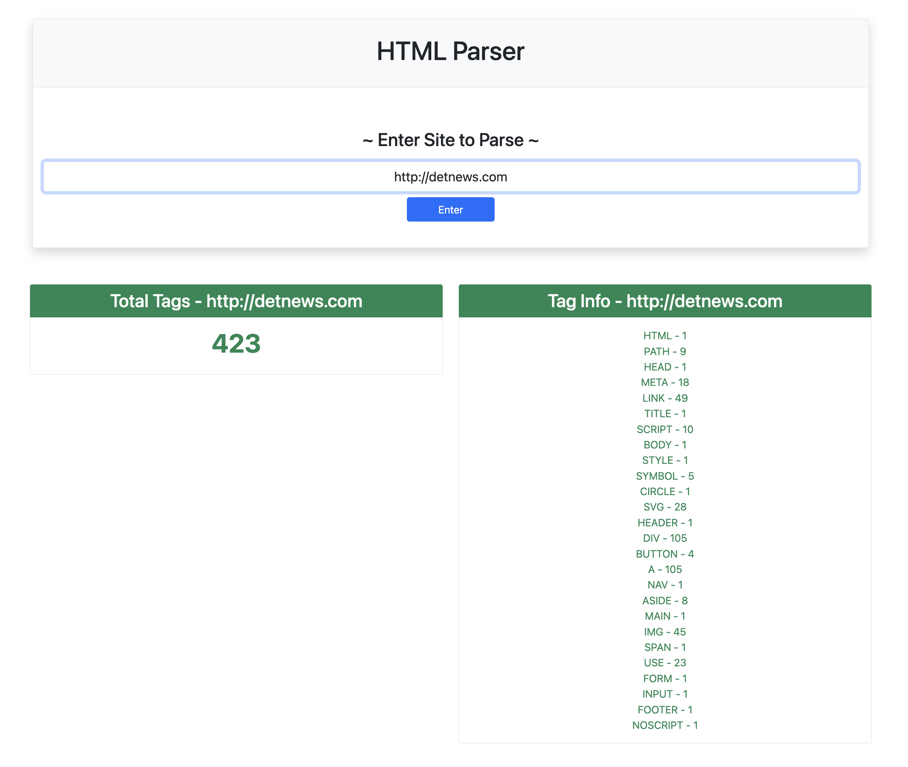

# HTML Tag Parser

For this class assignment the objective was to build a nodejs application that could take a URL and parse out the HTML tags within its webpage. The application will count the total number of html tags within the webpage.

The application is hosted on a EC2 server with MySqL database used to cache the tags.

You will need to add .env file with populated environment variables

Note: 

> for parsing `www.emich.edu` I was getting forbidden with message `Enable JavaScript and cookies to continue` to get around this I swapped out Axios fetch for puppeteer. Puppeteer will require a browser be installed on the VM. Use `sudo apt install chromium-browser chromium-codecs-ffmpeg`

```
npm install
```
Run the nodejs app with nodemon to help restart the app
```
npm run dev
```
[View Live WebSite](https://thelowerorbit.com:5000)

